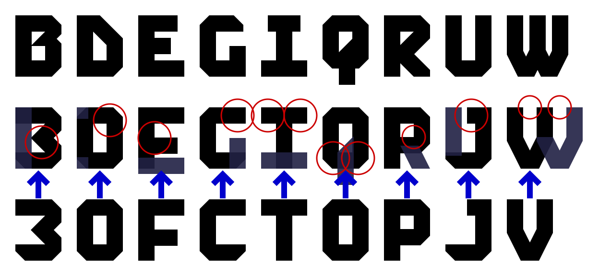

# Deiphobus typeface design guide

## Design space

The glyphs are mostly designed in a 96×128 (32·3×4) rectangle, the wider letters 'M' and 'W' in a 128×128 (32·4×4) square. From that design space they are scaled up by a factor of 11, chosen so that the cap height is close to 70% of the standard em-size of 2048.

The glyphs are given 16 units in design space (16·11 = 176 units in font coordinates) of padding on both the left and the right side, so that when no kerning rules apply, the spacing between adjacent letters will be 32 design space units (352 font coordinate units).

## Glyph geometry

The regular glyph stem width is 34 (374 in font coordinates). This value is chosen because it gives us 48 as a good approximation of √2 times the stem width and 38 as a good approximation of ½·√5 times the stem width, which are needed to get about the same width for 1:1 (45°) and 2:1 slopes, respectively.

Only straight line segments are used; and mostly only lines that are horizontal, vertical, at 1:1 (45°) slopes or 1:2 or 2:1 slopes. Other angles are only used in the asterisk glyph, because all draft designs of asterisks within the usual design rules were deemed unsatisfactory.

Where the general glyph shape would have curved lines, in this typeface the inner curve is represented by rectangular or triangular shapes, whereas the outer curve's representation changes angles in 45° increments, forming octagonal shapes. All lines of the outer curve are generally at a distance of about 34 units from the corners of the inner shape. For horizontal and vertical lines that means exactly 34 units distance. The diagonal lines are closest to the inner corner points at an offet of (24; 24) which is at a distance of 24·√2 ≈ 33.9411 . The letter ‹B› deviates from these metrics, because strict adherence to these distances would leave the indent where both arcs meet unnoticeably small.

Diacritics are designed with a smaller stem width of 24 and use 34 as their approximation of √2 times the stem width.

## Glyph design

Despite the blocky geometric style of the typeface, glyphs are designed to be distinguishable even where the generic shapes of letters are similar. The design takes direct inspiration from the forgery-impeding typefaces used on vehicle registration plates.

The glyphs are primarily sans-serifs. But the letter ‹I› has slab serifs to make it occupy the same width as the majority of the letters. Its upper serifs are shorter than the lower ones to distinguish it from ‹T› even when the bottom is obscured. The letter ‹J› has a slab serif to distinguish it from ‹U› even when the left side is obscured. And the digit ‹1› has an underline/slab serifs to make it clearly distinct from a ‹7› even when the text orientation is unclear and the reader is unfamiliar with the typeface's digit designs.
